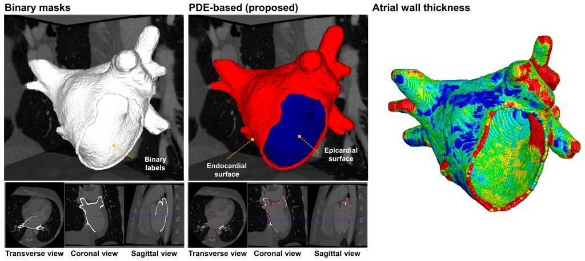

# AutoAWT

### [[Paper]](link) [[Project Page]](https://github.com/ohseokkwon/AutoAWT/)<br>

AutoAWT is a general-purpose wall thickness measurement algorithm for 3D atrial wall thickness measurements, which can be used using binary mask images generated by any segmentation software. This algorithm includes the detection of endocardial and epicardial and wall thickness measurement by the Laplace equation and Euler's method.

 <br>

The code was written by [Oh-Seok Kwon](link) with support from [Hui-Nam Pak]().

# Getting Stated

### Installation
- Dependencies
  - CUDA 10.0 ([download link](https://developer.nvidia.com/cuda-10.0-download-archive)).

- Datasets repository
  - The sample mask images for AutoAWT in [datasets/Phantom](/datasets/Phantom).

### Run
You can build & run (Visual studio 2015).
```
Step 1. select directory of mask images (datasets/Phantom/masks_1).
Step 2. select directory of DCM (datasets/Phantom/ct)
```

Derived results
```
- WT-endo.plt : Calculated wall thickness from endocardium to epicardium
- WT(projected)-PatientID.plt : Wall thickness projected to surface mesh
- WT(projected)-PatientID.stl : surface mesh
- surface_mesh.stl : Reconstructed surface mesh
- Epi-Endo directory : Images labeled as endocardium, epicardium, and myocardium in binary images
   (pixel value 1: endocardium, 2: myocardium, 3: epicardium)
```

# Citation
If you find this code useful, please consider citing our paper.
```
@article{
title={},
author={},
journal={},
volume={},
number={},
pages={},
yaer={},
publisher={}
}
```

# Quations / Issues
If you have any questions or issues using this code, please make a log to the the Issue tab.

# Acknowledgements
